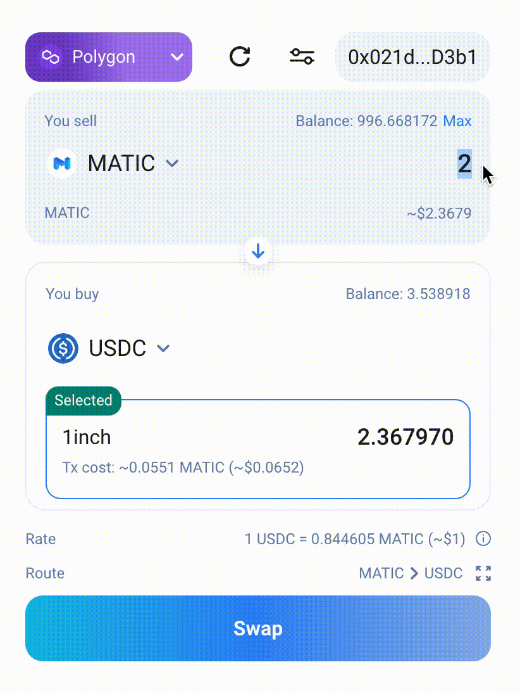

## Demo project @yozh-io/1inch-widget

This is a [Create React App](https://create-react-app.dev/) project bootstrapped with [`create-react-app`](https://create-react-app.dev/docs/getting-started) to showcase how to integrate the **dexknot-base** package in your own projects. It uses react-scripts@5.0.1.





---

To start the demo:

```bash
yarn          # install dependencies
yarn start    # run the development server
# or
npm           # install dependencies
npm run start # run the development server
```

Navigate to [http://localhost:3000](http://localhost:3000) to see the widget.

---

# Props

These are the props you can pass into your `<SwapWidget />` React component.

_ALL PROPS ARE NOT REQUIRED_

| Prop                            | Type                                     | Value                                                                                                                                         | Default                                                                                                                                                                                                                                                                              |
|:--------------------------------|:-----------------------------------------|:----------------------------------------------------------------------------------------------------------------------------------------------|:-------------------------------------------------------------------------------------------------------------------------------------------------------------------------------------------------------------------------------------------------------------------------------------|
| **`jsonRpcEndpoint`**           | <pre>{<br>  [chainId in SupportedChainId]: string; <br>}</pre> | In order for a software application to interact with the blockchain, it must connect to node.                           | <pre>{<br>  1: 'https://cloudflare-eth.com',<br>  56: 'https://bsc-dataseed1.ninicoin.io',<br>  137: 'https://polygon-rpc.com/', <br>  250: 'https://rpc.ftm.tools', <br>  42161: 'https://arb1.arbitrum.io/rpc', <br>  43114: 'https://api.avax.network/ext/bc/C/rpc', <br>} </pre> |
| **`width`**                     | `string or number`                       | You can customize the width by passing a number (of pixels) to the width prop of the widget.                                                  | `418`                                                                                                                                                                                                                                                                                |
| **`referrerOptions`**           | <pre>{<br>  [chainId: number]: {<br>    "referrerAddress": string,<br>    "fee": number,<br>  }<br>}</pre>| Fee is a number from 1 to 3 percent. <br/> After each swap, a percentage from swap amount equal to fee will be transferred to referrerAddress | <pre>{<br>  1: {<br>    "referrerAddress": "",<br>    "fee": 0,<br>  }<br>}</pre>                                                                                                                                                                                                   |
| **`defaultInputTokenAddress`**  | <pre>{<br>  [chainId: string]: {<br>    "defaultInputTokenAddress": string<br>  }<br>}</pre>| Address of the token to be selected by default in the input field (e.g. USDC) for each network chain ID. If left empty the widget will use the native token of the connected chain as default. This can be explicitly defined by the special string 'NATIVE'. For convenience you may pass a single string instead of a chainId mapping.   | ``string or 'NATIVE'``                                                                                                                                                                                                                                                               |
| **`defaultOutputTokenAddress`** | <pre>{<br>  [chainId: string]: {<br>    "defaultOutputTokenAddress": string<br>  }<br>}</pre>| Address of the token to be selected by default in the input field (e.g. USDC) for each network chain ID. None if left empty. Any addresses provided in this parameter must be included in the tokenList. | ``string or 'NATIVE'``                                                                                                                                                                                                                                                               |
| **`defaultTypedValue`**         | <pre>{<br>  [chainId in SupportedChainId]?: BigNumberish; <br>}</pre> | Value in wei. This value will respect the decimals of the inputTokenAddress. If the defaultInputTokenAddress is USDC, defaultTypedValue should be `1000000` (it means 1 USDC). | `0`                                                                                                                                                                                                                                                                                  |
| **`locale`**                    | `SupportedLocale`                       | Specifies an explicit locale to use for the widget interface. This can be set to one of the values exported by the library in SUPPORTED_LOCALES.| `en`                                                                                                                                                                                                                                                                                 |
| **`customTheme`**                     | `Theme`                       | Specifies a custom theme. See [MUI THEME](https://mui.com/material-ui/customization/theming/) | light `default-theme`                                                                                                                                                                                                                                                                |

## References

- [YOZH site](https://yozh.io)
- [Api reference](https://docs.1inch.io/docs/aggregation-protocol/api/swagger)
